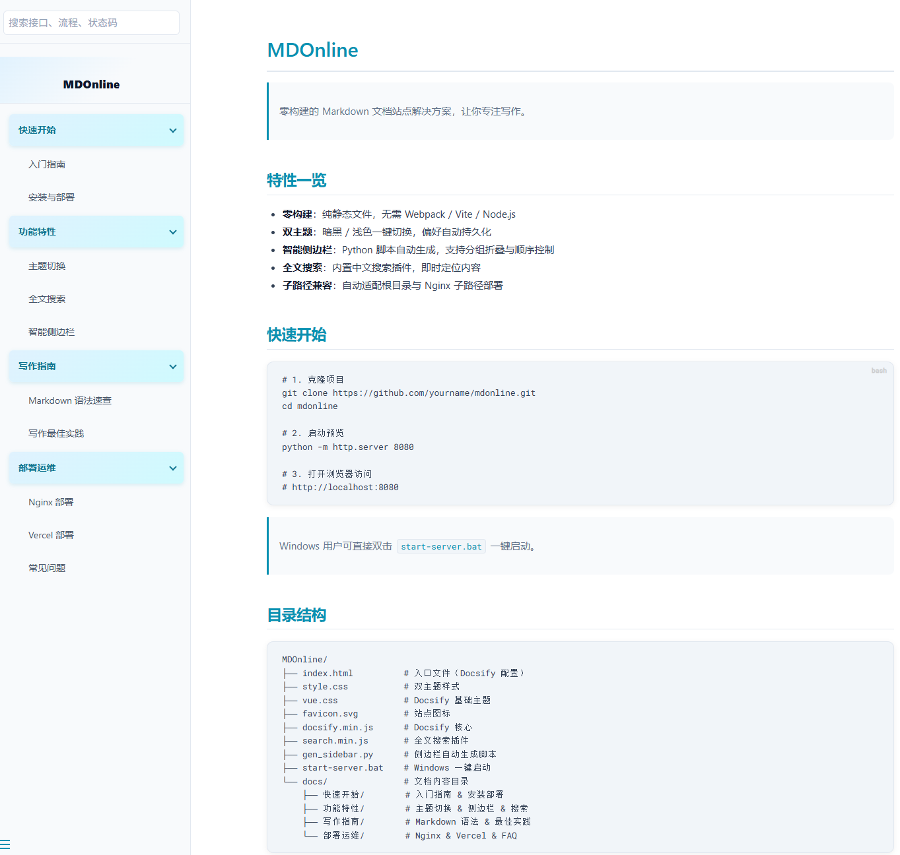
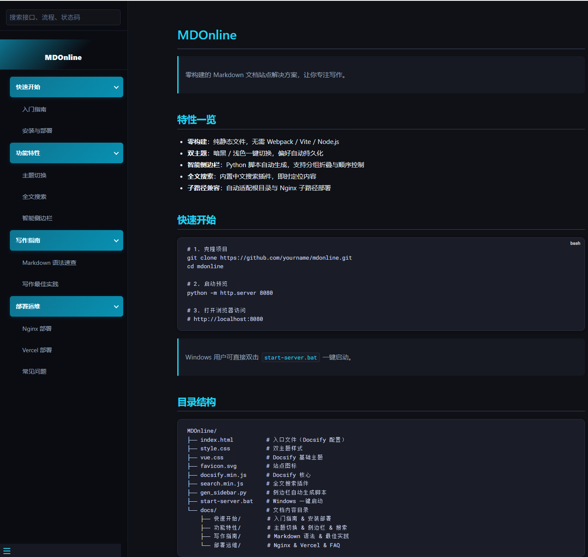

<p align="center">
  
</p>

<h1 align="center">MDOnline</h1>

<p align="center">
  <strong>丢进 Markdown，即刻拥有一个漂亮的文档站点</strong>
</p>

<p align="center">
  <a href="http://120.26.80.140:13180/mdonline/#/">在线演示</a> •
  <a href="#特性">特性</a> •
  <a href="#快速开始">快速开始</a> •
  <a href="#目录结构">目录结构</a> •
  <a href="#配置说明">配置说明</a> •
  <a href="#部署">部署</a> •
  <a href="#许可证">许可证</a>
</p>

<p align="center">
  
</p>

<p align="center">
  
</p>

<p align="center">
  💬 联系作者：<font color="#22c55e">QQ 1224829392</font>
</p>
---

## 特性

- **零构建** — 纯静态文件，无需 Node.js / Webpack / Vite，丢到任意 Web 服务器即可运行
- **暗黑 / 浅色双主题** — 一键切换，选择自动持久化到 localStorage
- **侧边栏自动生成** — 运行 `gen_sidebar.py` 扫描目录，自动生成导航，无需手动维护 `_sidebar.md`
- **折叠分组** — 侧边栏分组可点击折叠/展开，适合多模块文档
- **全文搜索** — 内置搜索插件，支持中文
- **子路径部署** — 自动检测 `basePath`，兼容根目录和 Nginx 子路径部署
- **表格 / 代码块增强** — 暗黑主题下表格奇偶行区分、代码块高对比度、API 标题醒目
- **响应式** — 移动端自动收起侧边栏

## 快速开始

### 方式一：单文件桌面版（推荐）

下载 `MDOnline.exe`，**双击运行**即可，无需安装任何依赖：

1. 将 `MDOnline.exe` 放到任意目录
2. 双击运行，程序会自动：
   - 在同目录下创建 `docs/` 示例文档
   - 生成侧边栏导航
   - 启动本地服务并打开浏览器 → [http://localhost:8080](http://localhost:8080)
3. 把你的 `.md` 文件放入 `docs/` 子目录中
4. 点击页面右下角 **🔄 刷新按钮** 重新生成侧边栏，无需重启

```
MDOnline.exe          ← 双击运行
docs/                 ← 首次运行自动创建
  你的模块/
    文档一.md
    文档二.md
```

> **退出**：关闭命令行窗口或按 `Ctrl+C` 停止服务。

---

### 方式二：源码 + Python 静态服务

**1. 下载项目**

```bash
git clone https://github.com/xianyuxm/MDOnline.git
cd MDOnline
```

**2. 写你的文档**

把 Markdown 文件放入 `docs/` 下的子目录中，例如：

```
docs/
  getting-started/
    安装指南.md
    快速上手.md
  api-reference/
    用户接口.md
    订单接口.md
```

**3. 生成侧边栏**

```bash
python gen_sidebar.py
```

脚本会自动扫描 `docs/` 下的子目录，读取每个 `.md` 文件的一级标题作为链接文字，生成 `_sidebar.md`。

**4. 本地预览**

**方式一：Python**

```bash
python -m http.server 8080
```

**方式二：使用启动脚本（Windows）**

双击 `start-server.bat`，会自动生成侧边栏并启动服务。

然后打开 http://localhost:8080 即可预览。

## 目录结构

```
MDOnline/
├── MDOnline.exe        # 单文件桌面版（双击运行，无需依赖）
├── index.html          # 入口页面（Docsify 配置 + 插件）
├── style.css           # 双主题样式（暗黑 + 浅色）
├── vue.css             # Docsify 基础主题（勿删）
├── docsify.min.js      # Docsify 核心
├── search.min.js       # 全文搜索插件
├── favicon.svg         # 站点图标
├── gen_sidebar.py      # 侧边栏自动生成脚本
├── start-server.bat    # Windows 一键启动脚本
├── _sidebar.md         # 自动生成的侧边栏（勿手动编辑）
└── docs/               # 你的文档内容
    ├── _sidebar.md     # 自动生成（与根目录相同）
    └── your-module/    # 按模块建子目录
        └── 你的文档.md
```

## 配置说明

### 侧边栏生成（gen_sidebar.py）

打开 `gen_sidebar.py`，修改顶部的三个配置项：

```python
# 分组在侧边栏中的显示顺序
GROUP_ORDER = ['getting-started', 'api-reference']

# 目录名 → 侧边栏分组显示名
GROUP_NAMES = {
    'getting-started': '快速开始',
    'api-reference': 'API 参考',
}

# 不出现在侧边栏中的文件
SKIP_FILES = {'_sidebar.md', '_navbar.md', 'README.md'}
```

**新增文档**：把 `.md` 文件放入对应目录，重新运行 `gen_sidebar.py` 即可。

**新增模块**：创建新目录 → 在 `GROUP_ORDER` 和 `GROUP_NAMES` 中添加映射 → 重新运行脚本。

### 站点基本信息（index.html）

修改 `index.html` 中的 Docsify 配置：

```javascript
window.$docsify = {
  name: '你的站点名称',           // 侧边栏顶部标题
  homepage: 'docs/README.md',     // 首页文档
  // ...
};
```

同时修改 `<title>` 标签和 `<meta name="description">`。

### 主题切换

- 暗黑模式为默认主题
- 页面右下角的圆形按钮可一键切换暗黑 / 浅色
- 用户选择自动保存到浏览器 localStorage

## 部署

### Nginx

将整个目录放到服务器上，添加如下 Nginx 配置：

```nginx
# 访问 /mdonline 自动跳转到带斜杠的路径
location = /mdonline {
    return 301 /mdonline/;
}

location ^~ /mdonline/ {
    alias /data/front/mdonline/;
    index index.html index.htm;
    try_files $uri $uri/ /mdonline/index.html;

    # 让 Nginx 识别 .md 文件（Docsify 需要）
    location ~ \.md$ {
        default_type text/plain;
        charset utf-8;
    }
}
```

修改完成后执行 `nginx -s reload` 重载配置。

> **注意**：`basePath` 已配置为自动检测，无需手动设置。无论部署在根目录还是子路径，都能正常工作。

### GitHub Pages

1. 将项目推送到 GitHub 仓库
2. 在仓库 Settings → Pages 中选择分支和目录
3. 等待部署完成即可访问

### 其他静态托管

MDOnline 是纯静态站点，可以部署到任何静态文件托管服务：
- Vercel
- Netlify
- Cloudflare Pages
- 阿里云 OSS + CDN

## 技术栈

| 组件 | 说明 |
|------|------|
| [Docsify](https://docsify.js.org/) | Markdown 渲染引擎和路由 |
| CSS Variables | 双主题实现（暗黑 / 浅色） |
| localStorage | 主题偏好持久化 |
| Python | 侧边栏自动生成脚本 |

## 常见问题

**Q: MDOnline.exe 双击没有反应？**

A: 可能被杀毒软件拦截，请将 exe 添加到白名单后重试。或右键 → 以管理员身份运行。

**Q: 如何更换 MDOnline.exe 的文档内容？**

A: 直接编辑 exe 同目录下的 `docs/` 目录，新增或修改 `.md` 文件后点击页面右下角的 **🔄 刷新按钮** 即可更新侧边栏。

**Q: 新增文档后侧边栏没有更新？**

A: 需要重新运行 `python gen_sidebar.py`，或者使用 `start-server.bat` 启动（会自动运行）。

**Q: 部署到 Nginx 子路径后侧边栏显示"加载文档中"？**

A: 检查 Nginx 是否配置了 `.md` 文件的 MIME 类型（参见上方 Nginx 配置中的 `location ~ \.md$` 块）。

**Q: 如何修改主题颜色？**

A: 编辑 `style.css` 顶部的 `:root` CSS 变量。主要修改 `--theme-color`（主题色）和 `--theme-color-dim`（主题色暗色变体）。

**Q: 主题切换按钮在哪里？**

A: 页面右下角的圆形按钮。暗黑模式下显示 ☀（太阳），浅色模式下显示 ☾（月亮）。

## 许可证

[MIT License](LICENSE)
